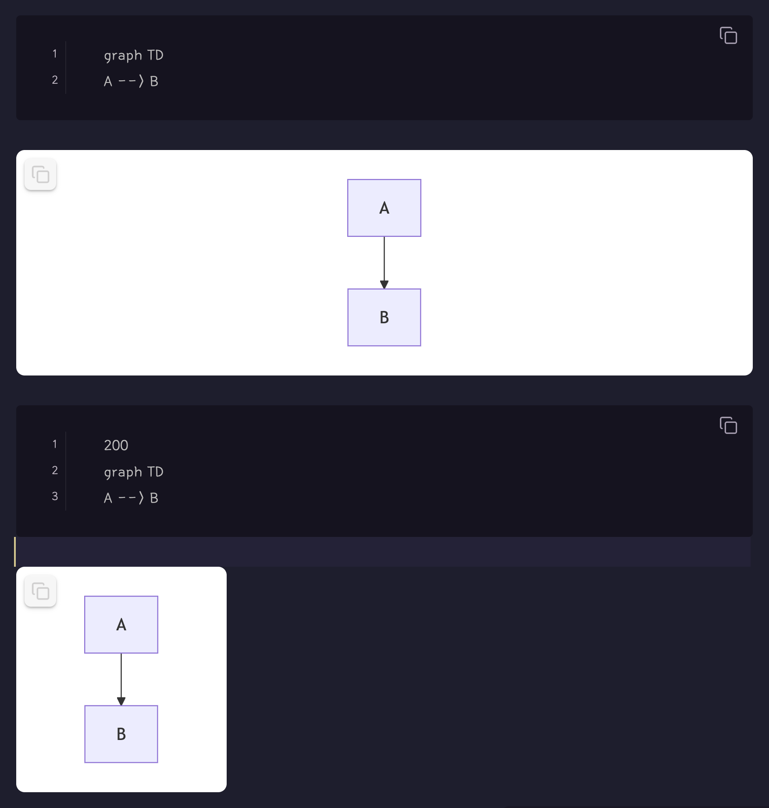
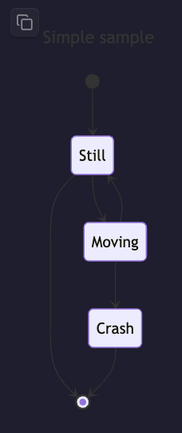
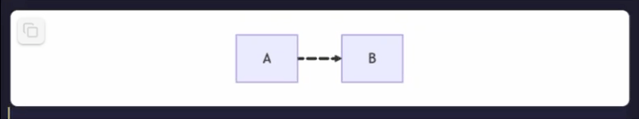
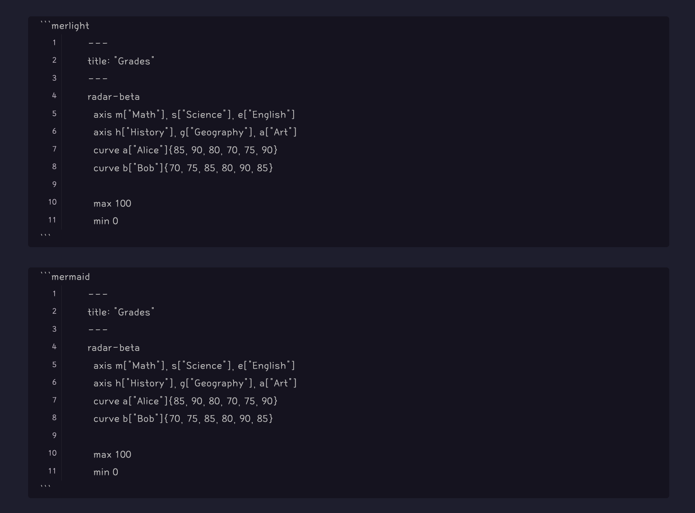
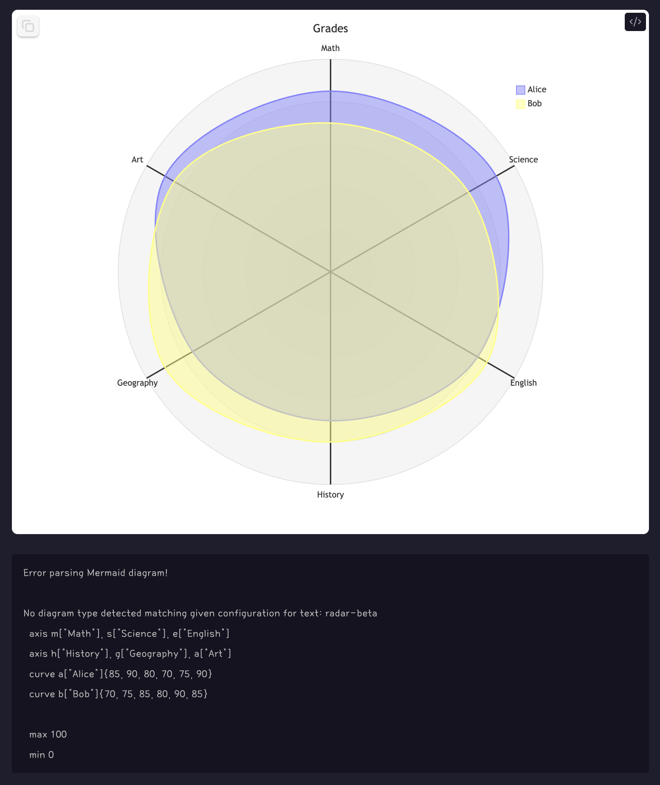

# Modern Mermaid

최신 Mermaid 다이어그램을 라이트/다크 테마 지원 및 이미지 복사 기능으로 렌더링합니다.

## Mermaid 버전 지원

| 플랫폼 | Mermaid 버전 | 확인일 |
|----------|----------------|----------|
| Obsidian 공식 빌드 | v11.4.1 | 26.2.1 |
| 이 플러그인 | **항상 최신** ✨ | - |

이 플러그인은 자동으로 최신 Mermaid 버전을 가져와서 사용하므로, 최신 기능과 구문을 사용할 수 있습니다!

## 기능

- 최신 구문으로 Mermaid 다이어그램 렌더링
- 세 가지 코드 블록 유형:
  - \`\`\`mer\`\`\` - 투명 배경 (설정에서 구성 가능)
  - \`\`\`merlight\`\`\` - 흰색 배경의 라이트 테마
  - \`\`\`merdark\`\`\` - 검은색 배경의 다크 테마
- 클릭하여 다이어그램을 PNG로 클립보드에 복사
- **팬 & 줌**: 마우스 휠로 줌, 드래그로 팬
- **더블클릭으로 줌**: 구성된 수준으로 줌 (기본값: 2배), 다시 클릭하면 원래 크기로 재설정
- 줌 컨트롤: 줌 인/아웃 및 재설정 버튼
- 중앙 정렬 레이아웃
- 고스트 스타일 Lucide 아이콘
- 사용자 정의 너비 지원 (코드 블록 첫 번째 줄에 픽셀 단위로 너비 추가)
- 원활한 통합을 위한 투명 배경 옵션
- **시작 시 최신 Mermaid 버전으로 자동 업데이트**
- **CDN 및 캐싱으로 빠른 로딩**
- **캐시된 버전으로 오프라인 지원**

## 사용법

### 기본 사용법

\```mer
graph TD
    A[시작] --> B[종료]
\```

\```merdark
graph LR
    A[다크] --> B[테마]
\```

### 팬 & 줌

설정에서 **팬 & 줌 사용**을 활성화하면 다음을 할 수 있습니다:

**마우스 휠 줌**
- 마우스 휠을 위/아래로 스크롤하여 줌 인/아웃
- 마우스 커서 위치를 중심으로 줌
- 부드러운 경험을 위해 최적화된 줌 속도

**드래그로 팬**
- 다이어그램을 클릭하고 드래그하여 이동
- 시각적 피드백을 위해 커서가 grab/grabbing으로 변경

**더블클릭 줌**
- 다이어그램의 아무 곳이나 더블클릭하여 줌 인
- 다시 더블클릭하여 원래 크기로 재설정
- 줌 레벨은 설정에서 구성 가능 (1.5배 - 5배, 기본값: 2배)
- 더블클릭 줌에만 부드러운 전환 애니메이션

**줌 컨트롤**
- 오른쪽 하단 모서리에 줌 컨트롤 버튼이 있습니다:
  - `−` 버튼: 줌 아웃
  - `+` 버튼: 줌 인
  - ⟲ 버튼: 원래 크기와 위치로 재설정


### 설정

Obsidian 설정 → Modern Mermaid에서 플러그인 동작을 사용자 정의할 수 있습니다:

- **Mermaid 버전**: 현재 로드된 Mermaid 라이브러리 버전 확인
- **팬 & 줌 사용**: 다이어그램의 마우스 휠 줌 및 드래그-팬 활성화
- **더블클릭 줌 레벨**: 더블클릭 시 줌 레벨 설정 (1.5배에서 5배, 기본값: 2배)
- **"mer"에 투명 배경**: `mer` 코드 블록의 투명 배경 활성화/비활성화
- **복사 시 배경 포함**: 다이어그램을 이미지로 복사할 때 배경색 포함
- **캐시 지우기**: 캐시된 Mermaid 라이브러리를 지우고 다시 다운로드

### 사용자 정의 너비

코드 블록의 첫 번째 줄에 너비(픽셀 단위)를 추가하여 다이어그램 크기를 제어할 수 있습니다:

**코드:**
```mer
300
graph TD
    A[Small] --> B[Diagram]
    B --> C[300px wide]
```

**결과:**


너비를 지정하지 않으면 다이어그램은 노트의 사용 가능한 공간을 채웁니다.

### 투명 배경

`mer` 코드 블록은 기본적으로 투명 배경을 사용하므로 모든 테마 또는 문서 스타일과 통합하기에 완벽합니다. 플러그인 설정에서 이를 구성할 수 있습니다.

**코드:**
```mer
200
---
title: Simple sample
---
stateDiagram-v2
    [*] --> Still
    Still --> [*]

    Still --> Moving
    Moving --> Still
    Moving --> Crash
    Crash --> [*]
```

**결과:**


참고: 다이어그램은 투명 배경을 가지므로 모든 노트 배경색과 원활하게 혼합됩니다.

### 애니메이션

최신 Mermaid 버전은 애니메이션 다이어그램을 지원합니다! 플러그인은 자동으로 최신 버전을 사용하므로 애니메이션 플로우차트 및 상태 다이어그램을 만들 수 있습니다.

**코드:**
```merlight
flowchart LR
    A e1@==> B
    e1@{ animate: true }
```

**결과:**


Mermaid 애니메이션에 대해 자세히 알아보기: [Mermaid 문서](https://mermaid.js.org/syntax/flowchart.html#animation)

## 왜 이 플러그인인가?

Obsidian의 내장 Mermaid 렌더러는 오래된 버전(v11.4.1)을 사용하므로 최신 Mermaid 기능과 구문을 사용할 수 없습니다. 이 플러그인은 항상 **최신 Mermaid 버전**을 가져와서 사용하므로 다음에 액세스할 수 있습니다:

**예시: Obsidian과 이 플러그인의 최신 Mermaid 구문 비교**

최신 Mermaid 구문으로 작성된 코드:


Obsidian의 내장 Mermaid (v11.4.1)는 최신 구문을 렌더링할 수 없습니다:


이 플러그인(항상 최신 버전)을 사용하면 위 코드로 작성된 다이어그램이 완벽하게 렌더링됩니다

- 최신 다이어그램 유형 및 구문
- 최신 버그 수정 및 개선 사항
- 애니메이션 다이어그램 및 기타 최신 기능
- Mermaid 문서 예제와 완전한 호환성

플러그인은 빠른 로딩을 위해 Mermaid 라이브러리를 캐시하고 캐시되면 오프라인에서 작동합니다.

## 크레딧

[Obsidian Sample Plugin](https://github.com/obsidianmd/obsidian-sample-plugin)로 구축되었습니다
