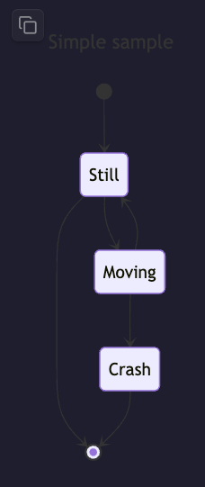

# Modern Mermaid

Render latest Mermaid diagrams with support for light/dark themes and image copy functionality.

## Mermaid Version Support

| Platform | Mermaid Version | Checked |
|----------|----------------|----------|
| Obsidian Official Build (v26.2.1) | v11.4.1 | 2026-02-01 |
| This Plugin | **Always Latest** ✨ | - |

This plugin automatically fetches and uses the latest Mermaid version, giving you access to newest features and syntax!

### Version 2.0.0 - Dynamic Loading System

Major update with CDN-based dynamic loading:

**New Features:**
- 🚀 **Auto-update**: Automatically checks and loads latest Mermaid version on startup
- ⚡ **Fast Loading**: Plugin size reduced from 5.9MB to 12KB with CDN loading
- 💾 **Smart Caching**: Caches Mermaid version for instant loading
- 🔔 **Notifications**: Shows update status via Obsidian notifications
- 📡 **Offline Support**: Works offline with cached version

**How it works:**
1. On startup, checks npm registry for latest Mermaid version
2. If new version available, fetches from CDN and caches it
3. Shows notification when update completes
4. Falls back to cached version if offline or CDN unavailable

## Features

- Render Mermaid diagrams with latest syntax
- Three code block types:
  - \`\`\`mer\`\`\` - Transparent background (configurable in settings)
  - \`\`\`merlight\`\`\` - Light theme with white background
  - \`\`\`merdark\`\`\` - Dark theme with black background
- Click to copy diagrams as PNG to clipboard
- Centered layout
- Ghost-style Lucide icons
- Custom width support (add width in pixels on first line of code block)
- Transparent background option for seamless integration
- **Auto-update to latest Mermaid version** on startup
- **Fast loading** with CDN and caching
- **Offline support** with cached version

## Usage

```mer
graph TD
    A[Start] --> B[End]
```

```merdark
graph LR
    A[Dark] --> B[Theme]
```

### Settings

You can customize plugin behavior in Obsidian Settings → Modern Mermaid:

- **Mermaid Version**: View currently loaded Mermaid library version
- **Transparent Background for "mer"**: Enable/disable transparent background for `mer` code blocks
- **Include Background in Copy**: Include background color when copying diagram as image
- **Clear Cache**: Clear cached Mermaid library and force re-download

### Custom Width

You can control the diagram size by adding the width (in pixels) on the first line of the code block:

**Code:**
````mer
300
graph TD
    A[Small] --> B[Diagram]
    B --> C[300px wide]
````

**Result:**


If you don't specify a width, the diagram will fill the available space in your note.

### Transparent Background

The `mer` code block uses transparent background by default, making it perfect for integration with any theme or document style. You can configure this in plugin settings.

**Code:**
````mer
200
---
title: Simple sample
---
stateDiagram-v2
    [*] --> Still
    Still --> [*]

    Still --> Moving
    Moving --> Still
    Moving --> Crash
    Crash --> [*]
````

**Result:**


Note: The diagram has a transparent background, allowing it to blend seamlessly with any note background color.

## Screenshots


## Credits

Built with [Obsidian Sample Plugin](https://github.com/obsidianmd/obsidian-sample-plugin)
