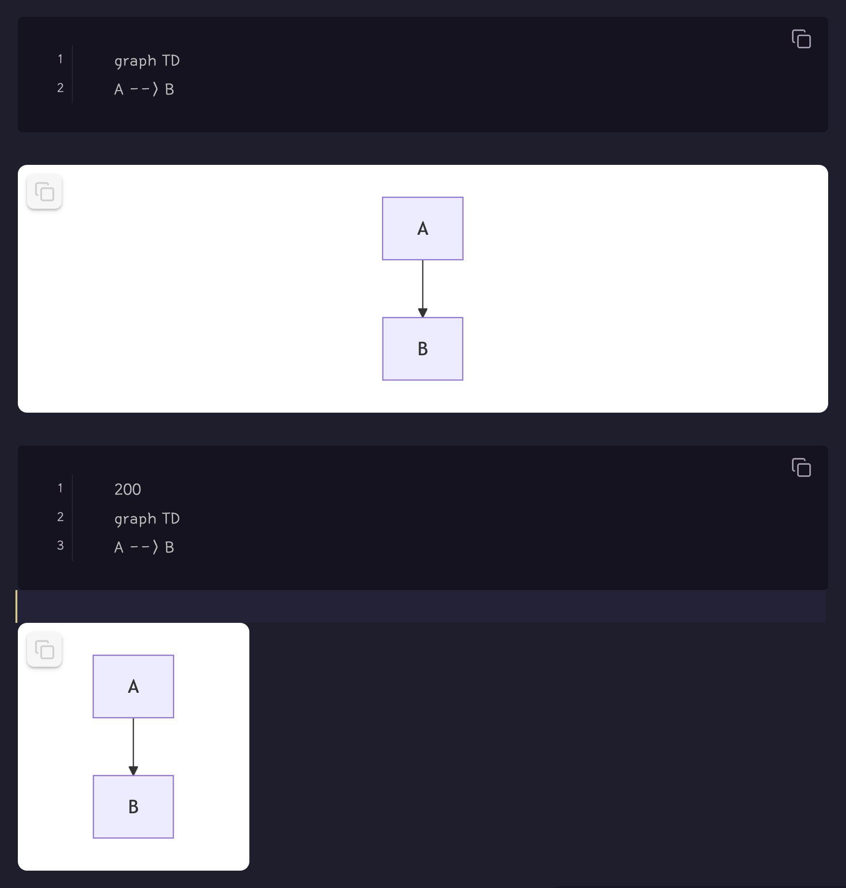
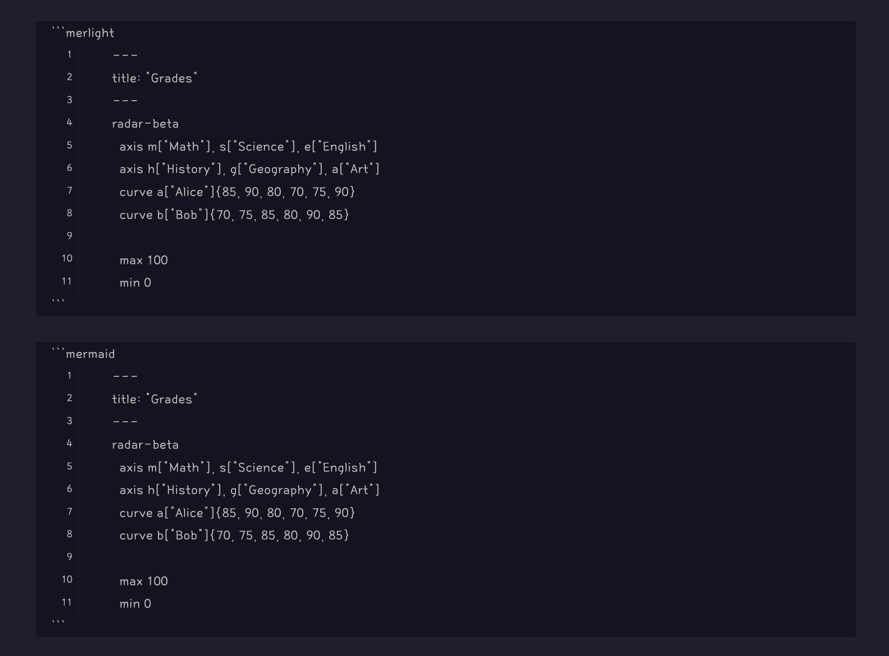
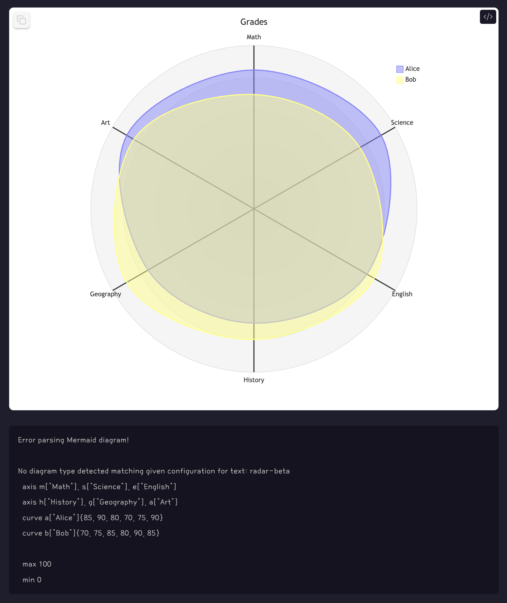

# Modern Mermaid

Render latest Mermaid diagrams with support for light/dark themes and image copy functionality.

## Mermaid Version Support

| Platform | Mermaid Version |
|----------|----------------|
| Obsidian Official Build | v11.4.1 |
| This Plugin | v11.12.2 (Latest) |

This plugin uses the latest Mermaid version, giving you access to the newest features and syntax!

## Features

- Render Mermaid diagrams with the latest syntax
- Three code block types:
  - \`\`\`mer\`\`\` - Default theme with white background
  - \`\`\`merlight\`\`\` - Light theme with white background
  - \`\`\`merdark\`\`\` - Dark theme with black background
- Click the copy button to copy diagrams as PNG to clipboard
- Centered layout
- Ghost-style Lucide icons
- Custom width support (add width in pixels on first line of code block)

## Usage

```mer
graph TD
    A[Start] --> B[End]
```

```merdark
graph LR
    A[Dark] --> B[Theme]
```

### Custom Width

You can control the diagram size by adding the width (in pixels) on the first line of the code block:

**Code:**
````mer
300
graph TD
    A[Small] --> B[Diagram]
    B --> C[300px wide]
````

**Result:**


If you don't specify a width, the diagram will fill the available space in your note.

## Screenshots




## Credits

Built with [Obsidian Sample Plugin](https://github.com/obsidianmd/obsidian-sample-plugin)
