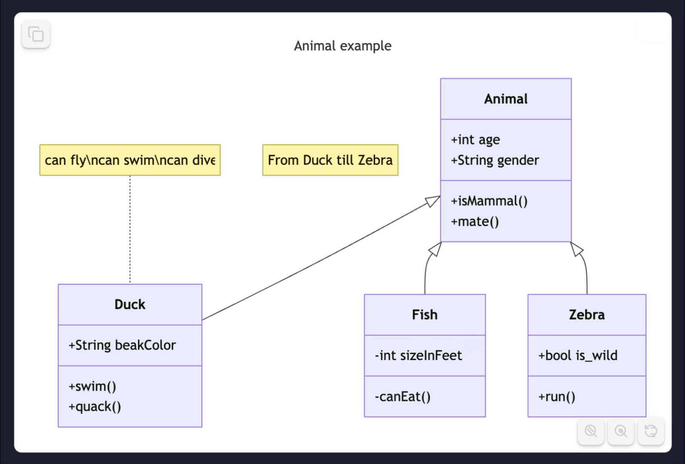

# Modern Mermaid

Render latest Mermaid diagrams with support for light/dark themes and image copy functionality.

## Mermaid Version Support

| Platform | Mermaid Version | Checked |
|----------|----------------|----------|
| Obsidian Official Build | v11.4.1 | 26.2.1 |
| This Plugin | **Always Latest** ✨ | - |

This plugin automatically fetches and uses latest Mermaid version, giving you access to newest features and syntax!

## Features

- Render Mermaid diagrams with latest syntax
- Three code block types:
  - \`\`\`mer\`\`\` - Transparent background (configurable in settings)
  - \`\`\`merlight\`\`\` - Light theme with white background
  - \`\`\`merdark\`\`\` - Dark theme with black background
- Click to copy diagrams as PNG to clipboard
- **Pan & Zoom**: Mouse wheel to zoom, drag to pan
- **Double-click to zoom**: Zoom to configured level (default: 2x), click again to reset
- Zoom controls: Zoom in/out and reset buttons
- Centered layout
- Ghost-style Lucide icons
- Custom width support (add width in pixels on first line of code block)
- Transparent background option for seamless integration
- **Auto-update to latest Mermaid version** on startup
- **Fast loading** with CDN and caching
- **Offline support** with cached version

## Usage

### Basic Usage

\```mer
graph TD
    A[Start] --> B[End]
\```

\```merdark
graph LR
    A[Dark] --> B[Theme]
\```

### Pan & Zoom

When **Enable Pan & Zoom** is enabled in settings, you can:

**Mouse Wheel Zoom**
- Scroll wheel up/down to zoom in/out
- Zoom centers on your mouse cursor position
- Zoom speed is optimized for smooth experience

**Drag to Pan**
- Click and drag on the diagram to move it around
- Cursor changes to grab/grabbing for visual feedback

**Double-Click Zoom**
- Double-click anywhere on the diagram to zoom in
- Double-click again to reset to original size
- Zoom level is configurable in settings (1.5x - 5x, default: 2x)
- Smooth transition animation for double-click zoom only

**Zoom Controls**
- Bottom-right corner has zoom control buttons:
  - `−` button: Zoom out
  - `+` button: Zoom in
  - ⟲ button: Reset to original size and position



### Settings

You can customize plugin behavior in Obsidian Settings → Modern Mermaid:

- **Mermaid Version**: View currently loaded Mermaid library version
- **Enable Pan & Zoom**: Enable mouse wheel zoom and drag-to-pan for diagrams
- **Double Click Zoom Level**: Set zoom level when double-clicking (1.5x to 5x, default: 2x)
- **Transparent Background for "mer"**: Enable/disable transparent background for `mer` code blocks
- **Include Background in Copy**: Include background color when copying diagram as image
- **Clear Cache**: Clear cached Mermaid library and force re-download

### Custom Width

You can control the diagram size by adding the width (in pixels) on the first line of the code block:

**Code:**
```mer
300
graph TD
    A[Small] --> B[Diagram]
    B --> C[300px wide]
```

**Result:**


If you don't specify a width, the diagram will fill the available space in your note.

### Transparent Background

The `mer` code block uses transparent background by default, making it perfect for integration with any theme or document style. You can configure this in plugin settings.

**Code:**
```mer
200
---
title: Simple sample
---
stateDiagram-v2
    [*] --> Still
    Still --> [*]

    Still --> Moving
    Moving --> Still
    Moving --> Crash
    Crash --> [*]
```

**Result:**


Note: The diagram has a transparent background, allowing it to blend seamlessly with any note background color.

### Animation

The latest Mermaid version supports animated diagrams! The plugin automatically uses the latest version, so you can create animated flowcharts and state diagrams.

**Code:**
```merlight
flowchart LR
    A e1@==> B
    e1@{ animate: true }
```

**Result:**


Learn more about Mermaid animations: [Mermaid Documentation](https://mermaid.js.org/syntax/flowchart.html#animation)

## Screenshots


## Credits

Built with [Obsidian Sample Plugin](https://github.com/obsidianmd/obsidian-sample-plugin)
